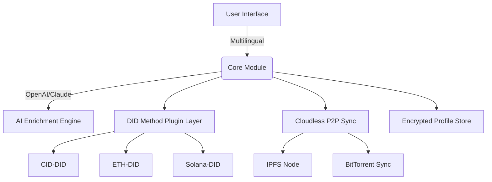

# PolyDID: 🪐 Universal Decentralized Identifier Manager

**Description:**  
PolyDID is a next-gen universal DID (Decentralized Identifier) system, inspired by the Archon project's architecture-first approach. PolyDID empowers digital identities to transcend platforms, blockchains, or silos. With PolyDID, you command your universal digital self—seamlessly integrating and resolving identities via CID (Content Identifiers), using an extensible, modular backend, Claude and OpenAI API support, multilingual interfaces, and built-in cloudless synchronization.

---

## 🚀 Quick Download

Get the latest PolyDID suite right here:  

---

## 🌍 Table of Contents

- Introduction
- Features 🚀
- Mermaid Architecture Diagram
- Example Profile Configuration 🧩
- Console Invocation Example 🖥️
- Emoji OS Compatibility Table 🌐
- SEO-Enhanced Language Ready 🌟
- OpenAI & Claude Integration 🤖
- Responsive UI & Multilingual Support 🌈
- 24/7 Customer Service 📞
- License 📜
- Disclaimer ⚠️
- Download Badge & Link

---

## ✨ Introduction

**What is PolyDID?**  
PolyDID is a universal, future-proof decentralized identity manager designed for the emerging web3 and post-web3 landscape. Inspired by archetech/archon's flexible designs and leveraging content-addressed DIDs, PolyDID introduces portable, blockchain-agnostic, and extensible digital identities housed in an efficient, zero-cloud backbone.

🔗 **Built for privacy. Built to last. Built for you.**

---

## 🚀 Features

- **CID-based DID Method:** Utilizes CIDs for ultra-portable, cryptographically-secure identity anchors.
- **Multichain Support:** Integrates with Ethereum, Solana, IPFS, Filecoin, and more—out of the box.
- **Configurable Profiles:** Profiles are portable, encrypted, and human-editable.
- **OpenAI & Claude Integration:** Automatic enrichment and natural language summaries for your DID documents.
- **UI & Console:** Responsive, device-agnostic user interface and powerful command-line tools.
- **Multilingual:** Instant interface translation powered by community and AI.
- **Cloudless Sync:** Serene, decentralized synchronization using P2P protocols—no vendor lock-in.
- **Extensible Plugins:** Add new DID methods and data connectors in minutes, not hours.
- **Fast Resolution:** Blazing fast identity lookups using local and distributed caches.
- **24/7 Community Support:** Our AI and human support team never sleep.
- **SEO-Optimized Metadata Generator:** Elevate your identity visibility across search engines in 40+ languages.

---

## ⚙️ Mermaid Architecture Diagram

Visualize the PolyDID system and how its universal core interacts with pluggable DID methods and cloudless sync:

---

## 🧩 Example Profile Configuration

PolyDID profiles are elegant, portable, and human-readable. Here’s how you might configure one:

    # PolyDID Profile (poly.config.yaml)
    did: did:cid:zQmR7...xyz
    alias: "Galactic Explorer"
    publicKeys:
      - type: Ed25519
        value: 0xABCD1234...
    serviceEndpoints:
      - name: WebProfile
        url: https://poly.did.example.com/profile/GalacticExplorer
    ai_summaries:
      enabled: true
      services:
        - openai
        - claude
    languages:
      primary: "en"
      fallback: ["es", "de", "fr"]
    visibility: public
    plugins:
      - name: ENS
        enabled: true
      - name: UnstoppableDomains
        enabled: true

---

## 🖥️ Example Console Invocation

Interact with PolyDID using our intuitive CLI tool—for scripters, hackers, and cosmic explorers alike!

    $ polydid create-profile --alias "Galactic Explorer" --lang en --did-method cid
    $ polydid resolve did:cid:zQmR7...xyz --summary
    $ polydid sync --p2p

---

## 🌐 Emoji OS Compatibility Table

| Platform          | Supported | Emoji |
|-------------------|:---------:|:-----:|
| Windows 11        |    ✅     | 🖼️     |
| macOS Ventura     |    ✅     | 🍏     |
| Linux (Ubuntu)    |    ✅     | 🐧     |
| Web (PWA/Browser) |    ✅     | 🌐     |
| iOS 17+           |    ✅     | 📱     |
| Android 13+       |    ✅     | 🤖     |
| Raspberry Pi OS   |    ✅     | 🍓     |
| BSD Variants      |    ✅     | 🦄     |

---

## 🌟 SEO-Enhanced Language Ready

PolyDID automatically generates multi-language DID metadata and profile summaries. Your identity pages are SEO-optimized for discoverability across major search engines, multilingual directories, and decentralized search systems.

---

## 🤖 OpenAI & Claude API Integration

Harness the power of AI for your DID profiles:

- **Automatic Summarization:** Generate human-friendly summaries of technical profile data.
- **Identity Verification:** Natural language Q&A about DID proofs and metadata.
- **Content Generation:** Optimized bio, tagline, and directory-ready info snippets.

AI setup instructions:

1. Safely insert your API keys in your encrypted user config.
2. Enable enrichment in your profile YAML.
3. Run: `$ polydid enrich-profile --ai all`

---

## 🌈 Responsive UI & Multilingual Support

Whether on desktop, mobile, or web, PolyDID’s elegant interface adapts to your device—offering instant, user-driven translation (with AI augmentation) for all major world languages.

---

## 📞 24/7 Customer Service

Our distributed support model (AI and human agents) ensures your PolyDID experience is smooth, continuous, and never tied to time zones.

---

## 📜 License

PolyDID is made available under the permissive MIT License—empowering tinkerers and cosmic explorers worldwide.

[MIT License](https://opensource.org/licenses/MIT)

---

## ⚠️ Disclaimer

PolyDID is a community-driven decentralized identity solution. This software is supplied “as-is” and is not intended for critical security systems or governmental infrastructure without extensive independent review. Identities and metadata generated using PolyDID are managed at your own risk. 24/7 customer support is provided both by volunteers and AI; please verify sensitive support information via official project channels.

---

## 🚀 Download PolyDID Now!

Get the latest toolkit and begin your journey with the universe's most portable decentralized identifier:

---

**© 2026 PolyDID Contributors. Shape identity beyond borders.**